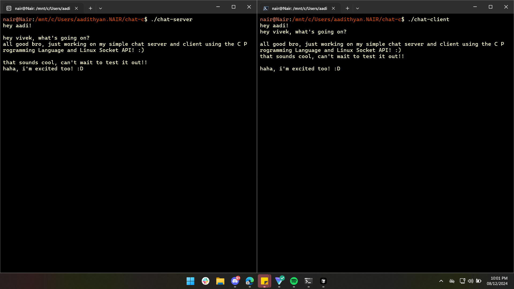

# c chat socket application

- supports real-time communication between a client and server
- implements basic socket programming concepts in c
- allows multiple clients to connect to the server simultaneously
- features message sending and receiving with console output
- error handling for socket operations and connection issues

